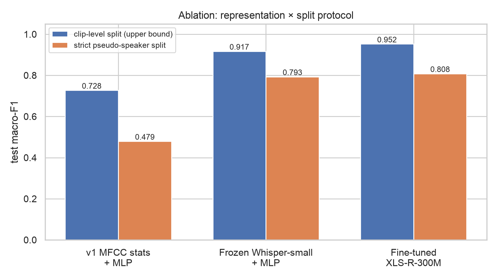
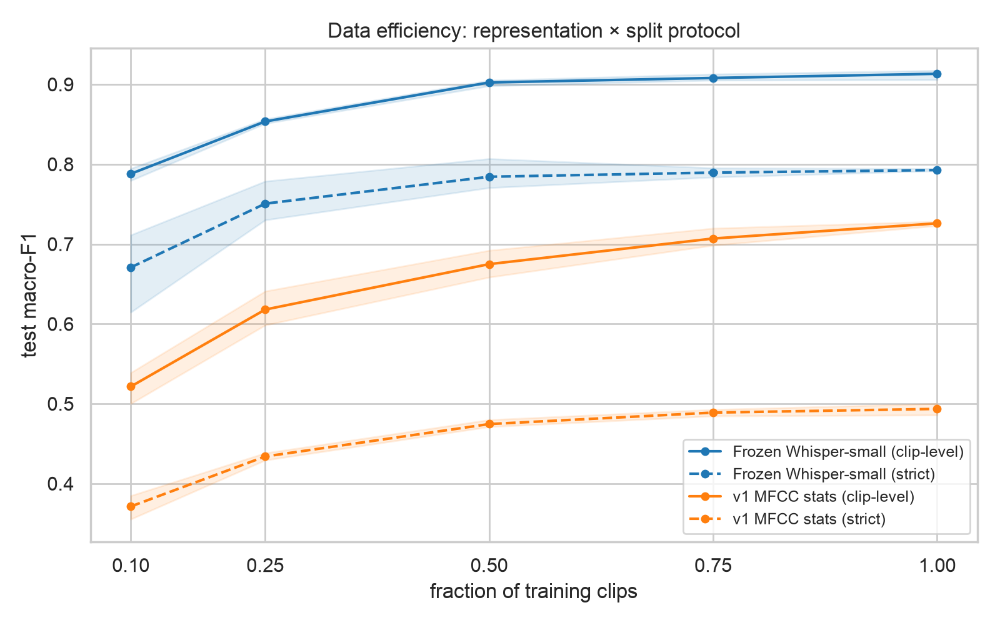

# Beyond Words (v2)

**Bangla Dialect Identification with Self-Supervised Speech Models**

Classifying regional Bangla accents from short audio clips. v2 replaces the original hand-crafted-features + MLP pipeline with pretrained self-supervised speech models and a leakage-aware data pipeline. Headline results: **0.917** test macro-F1 with frozen Whisper-small embeddings, **0.952** after end-to-end XLS-R-300M fine-tuning, and — under a strict pseudo-speaker split that removes speaker/channel leakage — honest estimates of **0.793 / 0.808**.

> Thesis: *A Neural Network Approach to Classifying Bangla Accentual Diversity* — framed as a Dialect Identification (DID) task.

---

## Dialect classes (9)

| Class | Clips |
|---|---|
| Barishal | 1,257 |
| Chattogram | 797 |
| Dhaka | 763 |
| Formal (standard register) | 1,654 |
| Khulna | 750 |
| Mymensingh | 1,053 |
| Noakhali | 1,213 |
| Rajshahi | 860 |
| Sylhet | 958 |
| **Total** | **9,305** (9,303 pass validation; ~13 hours) |

All clips are ~5-second `.wav`, standardized to 16 kHz mono PCM-16. Audio was collected from TV shows, films, and online content, originally in mp4.

**Note on "Formal":** Formal is a *speech register* (standard/prescribed Bangla), not a regional category. Treating it as a ninth class is a deliberate design choice, discussed in the thesis.

## What changed from v1

| | v1 | v2 |
|---|---|---|
| Features | Hand-crafted (MFCC etc.) in `features.csv` | Raw audio → pretrained speech-model embeddings |
| Model | Small feed-forward NN | Whisper-small encoder + weighted MLP head (baseline); fine-tuned XLS-R-300M |
| Splitting | Random | Stratified + source-disjoint where metadata exists; **strict pseudo-speaker split** (ECAPA clustering) for honest evaluation |
| Imbalance | Unhandled | Inverse-frequency class weights; macro-F1 reported |
| Leakage awareness | None | Source IDs tracked; limitations disclosed (see below) |

## Pipeline

```
build_manifest.py  →  manifest.csv          # scan, validate, standardize audio, extract source_id
build_split.py     →  manifest_split.csv    # train/val/test (group-aware where possible)
baseline_whisper.py cache  →  embeddings.npz  # Whisper-small encoder, mean-pooled, cached once
baseline_whisper.py train                     # weighted MLP head + evaluation
finetune_xlsr.py           →  xlsr_best.pt    # Phase 2: end-to-end XLS-R-300M (Kaggle T4)
build_speaker_clusters.py  →  manifest_speaker.csv       # Phase 3: ECAPA pseudo-speakers
build_split.py --manifest manifest_speaker.csv           #   → strict group-disjoint split
baseline_mfcc.py cache     →  features_v1.npz # Phase 3: v1-style MFCC ablation row
```

### Setup

**macOS (Apple Silicon) or any pip-based setup** — PyTorch uses the MPS backend on Apple GPUs automatically:

```bash
python3 -m venv .venv && source .venv/bin/activate
pip install -r requirements.txt
```

**Linux/Windows with NVIDIA GPU** (conda):

```bash
conda env create -f environment.yml
conda activate beyond-words
```

### Run

```bash
# 1. Manifest (validates + converts to 16k mono in place)
python build_manifest.py --root "path/to/bangla_accent_voice_data" --out manifest.csv --standardize

# 2. Split (75/10/15 stratified by district; grouped by source_id where available)
python build_split.py --manifest manifest.csv --out manifest_split.csv

# 3. Baseline
python baseline_whisper.py cache --manifest manifest_split.csv --out embeddings.npz
python baseline_whisper.py train --emb embeddings.npz --epochs 60 --device cpu

# 4. Strict split + local Phase 3 evaluations
python build_speaker_clusters.py embed   --manifest manifest_split.csv --out ecapa_embeddings.npz
python build_speaker_clusters.py cluster --manifest manifest_split.csv --emb ecapa_embeddings.npz --out manifest_speaker.csv
python build_split.py --manifest manifest_speaker.csv --out manifest_split_strict.csv
python baseline_whisper.py train --emb embeddings.npz --device cpu --remap-split manifest_split_strict.csv
python baseline_mfcc.py cache --manifest manifest_split.csv --out features_v1.npz
python data_efficiency.py

# 5. Inference demo (any audio file/format; needs a trained checkpoint)
python predict.py path/to/clip.wav
```

### Phase 2: fine-tune XLS-R on Kaggle (free T4)

End-to-end fine-tuning of `facebook/wav2vec2-xls-r-300m` needs a CUDA GPU; a free
Kaggle T4 (16 GB, 30 GPU-h/week) covers it in one ~2 h session. The run uses the
**same split** as the baseline via [`splits/manifest_split_rel.csv`](splits/manifest_split_rel.csv)
(relative paths, committed for reproducibility), so results are directly comparable.

1. **Upload the dataset once (keep it private — the audio is not redistributable):**
   a `dataset-metadata.json` is expected in the audio root; edit the `id` to your
   Kaggle username, then:
   ```bash
   pip install kaggle          # auth: kaggle.json, or an access token in ~/.kaggle/access_token
   kaggle datasets create -p path/to/bangla_accent_voice_data --dir-mode zip
   ```
   (Kaggle datasets are private by default; or use the website's *Create Dataset* UI.)
2. **Run the notebook:** upload [`notebooks/kaggle_xlsr_finetune.ipynb`](notebooks/kaggle_xlsr_finetune.ipynb)
   to Kaggle, attach the dataset, set accelerator to GPU T4 and Internet ON, *Save & Run All*.
   (Or push it headlessly: `kaggle kernels push --accelerator NvidiaTeslaT4` with a
   `kernel-metadata.json` — forcing the T4 matters, as Kaggle's default GPU assignment
   can hand out a P100 that current PyTorch builds no longer support.) The notebook's
   `MANIFEST` / `EXTRA_ARGS` variables select the strict split and `--augment`.
3. **Collect outputs** from the notebook's Output tab: `xlsr_best.pt`,
   `metrics_xlsr.json`, `test_predictions_xlsr.csv`.

`finetune_xlsr.py` also runs locally (auto-selects `cuda` > `mps` > `cpu`) — use
`--limit 48 --epochs 1` for a smoke test; a full run on Apple Silicon is impractical.

## Baseline results (v2, frozen Whisper-small embeddings + MLP)

**Test macro-F1: 0.917** (accuracy 0.916, n = 1,329; seed 42)

| District | F1 |
|---|---|
| Khulna | 0.986 |
| Formal | 0.970 |
| Sylhet | 0.951 |
| Rajshahi | 0.947 |
| Dhaka | 0.913 |
| Mymensingh | 0.890 |
| Chattogram | 0.880 |
| Barishal | 0.871 |
| Noakhali | 0.848 |

Main confusion pair: **Barishal ↔ Noakhali** (southern coastal dialects), consistent with known dialectological proximity; Mymensingh, a transitional dialect zone, spreads its errors across several neighboring classes. Noakhali and Barishal are the hardest classes.

<p align="center">
  
  
</p>

t-SNE of the frozen Whisper-small embeddings, colored by dialect:

<p align="center">
  
</p>

## Fine-tuned results (Phase 2, XLS-R-300M end-to-end)

**Test macro-F1: 0.952** (n = 1,329; 20 epochs, fp16, Kaggle T4; seed 42; same split as the baseline) — **+3.5 points over the frozen-embedding baseline**, with every district improving or holding. The largest gains land exactly on the baseline's weakest classes: Noakhali +6.1, Chattogram +4.4, Dhaka +5.9, Barishal +5.6.

| District | Baseline F1 | Fine-tuned F1 |
|---|---|---|
| Khulna | 0.986 | 0.986 |
| Sylhet | 0.951 | 0.982 |
| Rajshahi | 0.947 | 0.980 |
| Formal | 0.970 | 0.973 |
| Dhaka | 0.913 | 0.972 |
| Barishal | 0.871 | 0.927 |
| Chattogram | 0.880 | 0.924 |
| Mymensingh | 0.890 | 0.912 |
| Noakhali | 0.848 | 0.910 |
| **macro** | **0.917** | **0.952** |

The Barishal ↔ Noakhali confusion shrinks (31 → 15 errors) but remains the dominant error mode; Sylhet becomes near-perfect (137/137 recall). An 8-epoch run scored only 0.865 (still climbing); the 20-epoch validation curve plateaus at ~0.95 from epoch 11 onward, so longer training offers little further gain.

<p align="center">
  
  
</p>

Run artifacts (metrics, test predictions) live in [`reports/phase2/`](reports/phase2/); the checkpoint (1.2 GB) is not tracked in git.

## Strict-split results (Phase 3: how much was leakage?)

The clip-level scores above are disclosed as an **upper bound** because regional
classes lack speaker metadata. Phase 3 measures the gap. `build_speaker_clusters.py`
embeds every clip with ECAPA-TDNN and clusters per district (agglomerative, cosine);
the distance threshold is **calibrated on the Formal class**, whose true YouTube
source IDs are known (0.50 maximizes adjusted Rand index against them). The
resulting 1,683 pseudo-speaker groups are verified never to cross splits, giving a
strict group-disjoint split ([`splits/manifest_split_strict_rel.csv`](splits/manifest_split_strict_rel.csv)).
All three representations were then re-evaluated under the identical protocol
(same MLP/weighted loss/seed; XLS-R retrained from scratch on the strict train set):

| Representation | Clip-level split | Strict split | Δ |
|---|---|---|---|
| v1 MFCC stats + MLP (`baseline_mfcc.py`) | 0.728 | 0.480 | −24.8 |
| Frozen Whisper-small + MLP | 0.917 | 0.793 | −12.4 |
| Fine-tuned XLS-R-300M | 0.952 | 0.808 | −14.4 |
| Fine-tuned XLS-R-300M + train-time augmentation | — | 0.748 | — |

<p align="center">
  
</p>

Findings:

- **Roughly 12–14 points of the headline scores are attributable to speaker/channel
  overlap**, now measured rather than speculated. Strict-split numbers are the
  honest estimates; clip-level numbers remain comparable to prior work.
- **Self-supervised representations are more leakage-robust than hand-crafted
  features**: MFCCs lose 24.8 points under the strict split — half their apparent
  skill was channel signature — versus 12–14 for the pretrained models.
- **Fine-tuning still helps under the strict split** (+1.5 over the frozen
  baseline), but most of its clip-level advantage (+3.5) came from exploiting
  recording-channel cues.
- Formal, whose split was source-disjoint from the start, moves least among the
  well-populated classes — evidence the drop measures leakage, not model failure.
- **Augmentation is a negative result.** Training with a channel-suppression
  chain (gain, additive noise, 7-band EQ, telephone band-pass, pitch ±2 st,
  tempo 0.9–1.1; `finetune_xlsr.py --augment`) *lowered* strict macro-F1 from
  0.808 to 0.748. The likely mechanism is that pitch and tempo perturbations
  destroy dialect-bearing prosodic cues — for DID, unlike ASR, prosody is signal,
  not nuisance. A milder, prosody-preserving chain is future work.
- Caveats: pseudo-speakers are approximate (calibration ARI 0.347), and some strict
  test cells are dominated by single large clusters (e.g. Barishal), making
  per-class strict numbers noisier than the macro average.

### Data efficiency

`data_efficiency.py` retrains the identical MLP head on stratified fractions of
the train split (3 seeds per point, min–max bands):

<p align="center">
  
</p>

- **Frozen Whisper embeddings with 10 % of the labels (0.79 clip-level / 0.67
  strict) outperform MFCCs with 100 % (0.73 / 0.49)** — pretraining is worth more
  than a tenfold increase in labeled data here.
- Curves flatten beyond ~50 % of the data: the ~13 h corpus is adequately sized
  for the frozen-embedding approach.
- The representation gap widens under the strict split at every fraction — the
  leakage-robustness advantage of self-supervised features holds across scales.

Artifacts in [`reports/phase3/`](reports/phase3/): strict-split evaluations for all
three models, XLS-R strict metrics/predictions, and `strict_split_results.json`.

## Known limitations (disclosed by design)

- **Source/channel leakage in the canonical split — now measured.** About a third of Formal clips (559 of 1,654, 35 sources) carry recoverable YouTube video IDs and are split source-disjoint. All other clips have no recoverable speaker/source metadata, so the canonical split is clip-level for them and the same speaker or recording source may appear in both train and test. **Clip-level scores are therefore an upper bound** — quantified by the strict-split results above at 12–14 macro-F1 points for the pretrained models. Near-perfect clip-level scores for individual classes (e.g., Khulna) partly reflect recording-channel signatures.
- **Class imbalance** (Formal 1,654 vs. Khulna 750) is mitigated with weighted loss; macro-F1 is the headline metric, not accuracy.
- Clips are ~5 s; longer-context dialect cues are not modeled.

Mitigation status: speaker clustering (ECAPA) is implemented — the strict-split results above quantify the leakage. Channel-suppression augmentation was tested and *reduced* strict-split accuracy (negative result above); prosody-preserving augmentation remains future work.

## Roadmap

- [x] Phase 0 — data hygiene, manifest, leakage-aware splitting
- [x] Phase 1 — cached Whisper-small embedding baseline
- [x] Phase 2 — fine-tune `facebook/wav2vec2-xls-r-300m` end-to-end (fp16, Kaggle T4) — **0.952 test macro-F1**
- [x] Phase 3 — speaker-clustered strict split (**0.793 / 0.808** honest estimates), ablation table, augmentation study (negative result), data-efficiency curve
- [ ] Phase 4 — thesis write-up, reproducible release, inference demo

## Hardware

The project runs on a zero-hardware budget. Phases 0–1 were developed on an **NVIDIA GTX 1660 Ti (6 GB)** and reproduced within 0.3 macro-F1 points on an **Apple M1 (16 GB)** via PyTorch's MPS backend — the device is auto-selected (`cuda` > `mps` > `cpu`). Everything except end-to-end fine-tuning (embedding caches, MLP heads, ECAPA clustering, ablations) runs locally on the M1; the XLS-R fine-tuning runs (Phases 2–3) each used ~2.5 h of Kaggle's free T4 tier (16 GB, 30 GPU-h/week).

## Repository layout

```
├── build_manifest.py      # Phase 0: scan + validate + standardize audio
├── build_split.py         # Phase 0: leakage-aware train/val/test split
├── baseline_whisper.py    # Phase 1: cache embeddings, train + evaluate head
├── finetune_xlsr.py       # Phase 2: end-to-end XLS-R-300M fine-tuning
├── build_speaker_clusters.py  # Phase 3: ECAPA pseudo-speaker clustering
├── baseline_mfcc.py       # Phase 3: v1-style MFCC features (ablation)
├── data_efficiency.py     # Phase 3: label-fraction sweep + curve
├── predict.py             # Phase 4: inference demo (dialect + confidence)
├── splits/                # committed splits (relative paths, reproducibility)
│   ├── manifest_split_rel.csv         # canonical clip-level split
│   └── manifest_split_strict_rel.csv  # Phase 3 strict pseudo-speaker split
├── environment.yml        # conda environment (CUDA machines)
├── requirements.txt       # pip environment (macOS / Apple Silicon or any platform)
├── notebooks/             # analysis notebooks (EDA, figures)
│   ├── beyond-words.ipynb
│   └── kaggle_xlsr_finetune.ipynb
├── reports/
│   ├── figures/           # result figures (baseline + fine-tuned + ablation)
│   ├── phase2/            # XLS-R run metrics + test predictions
│   └── phase3/            # strict-split evaluations + ablation artifacts
├── docs/                  # thesis materials
│   ├── thesis/            #   chapter outline + methodology/results/discussion drafts
│   ├── reproducibility.md #   exact result→command map, release checklist
│   └── caveat.txt         #   original leakage caveat note
├── LICENSE                # MIT
└── README.md
```

Generated artifacts (manifests, `embeddings.npz`, `ecapa_embeddings.npz`,
`features_v1.npz`, model checkpoints) and the audio dataset are **not** tracked in
git — regenerate them with the pipeline above.

## Acknowledgements

Built on [OpenAI Whisper](https://github.com/openai/whisper) encoders, [XLS-R](https://huggingface.co/facebook/wav2vec2-xls-r-300m) fine-tuning via the Hugging Face `transformers` ecosystem, [SpeechBrain](https://speechbrain.github.io/)'s ECAPA-TDNN for speaker clustering, and [audiomentations](https://github.com/iver56/audiomentations) for the augmentation study.

## License

Released under the [MIT License](LICENSE). The dataset audio is not covered by this license and is not distributed in this repository.
