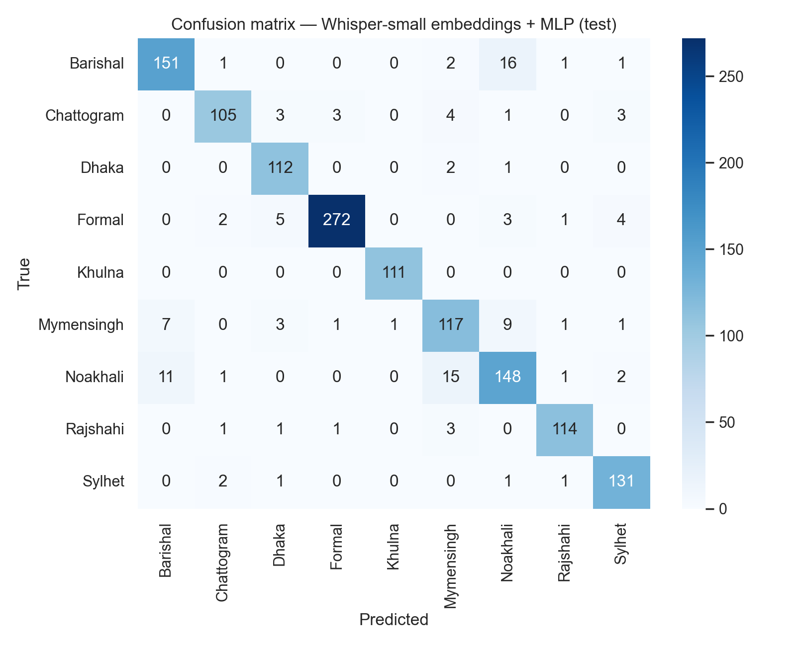
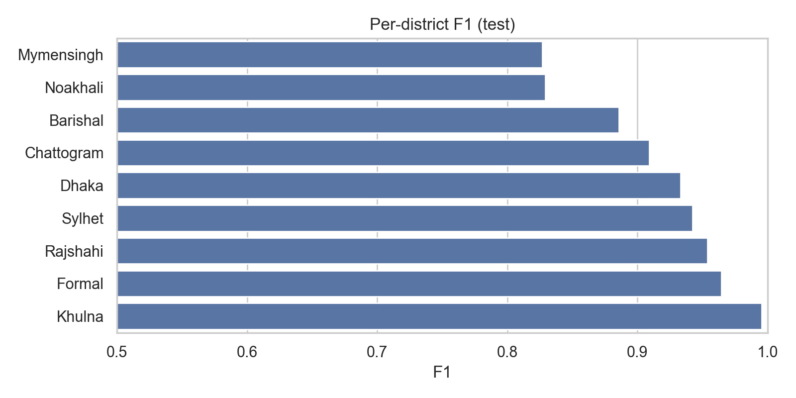
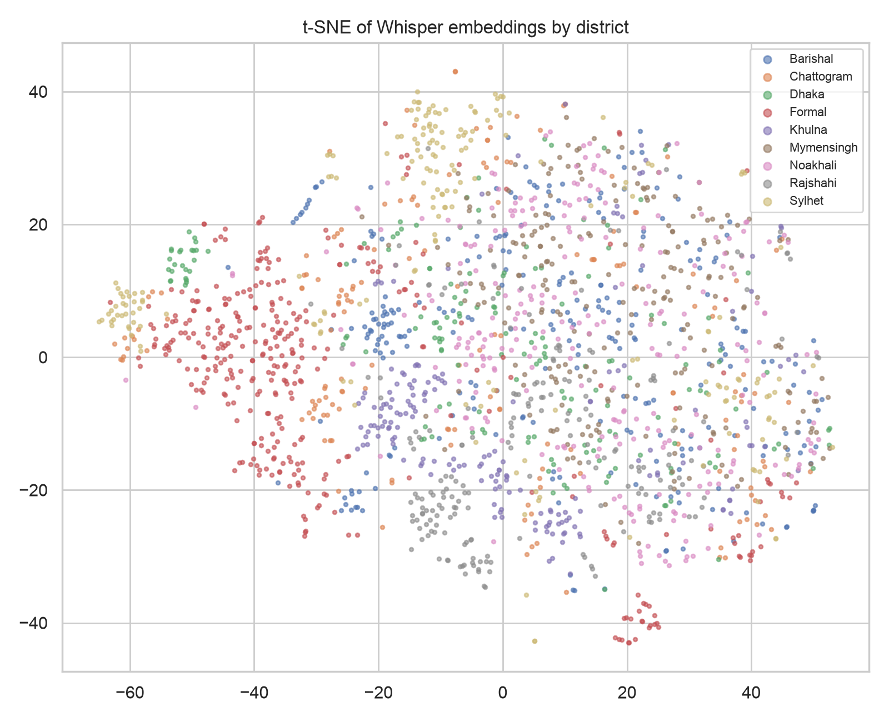
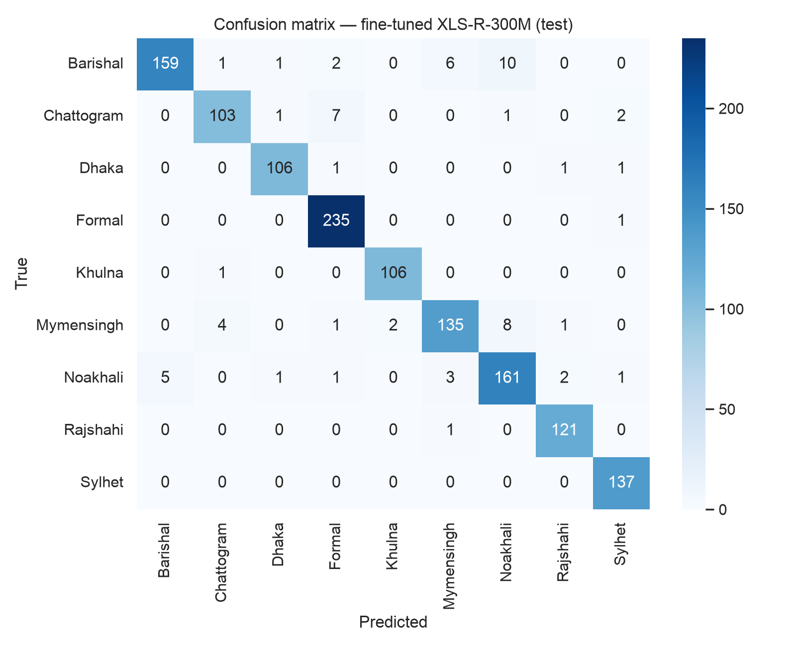
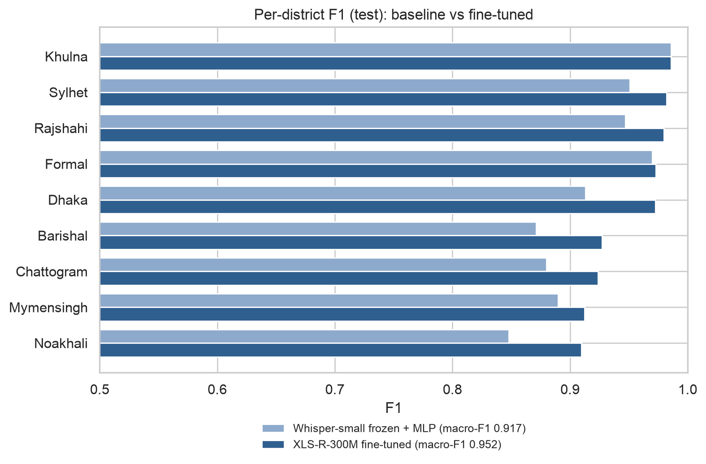

# Beyond Words (v2)

**Bangla Dialect Identification with Self-Supervised Speech Models**

Classifying regional Bangla accents from short audio clips. v2 replaces the original hand-crafted-features + MLP pipeline with pretrained speech-model embeddings and (upcoming) end-to-end fine-tuning, plus a leakage-aware data pipeline.

> Thesis: *A Neural Network Approach to Classifying Bangla Accentual Diversity* — framed as a Dialect Identification (DID) task.

---

## Dialect classes (9)

| Class | Clips |
|---|---|
| Barishal | 1,257 |
| Chattogram | 797 |
| Dhaka | 763 |
| Formal (standard register) | 1,654 |
| Khulna | 750 |
| Mymensingh | 1,053 |
| Noakhali | 1,213 |
| Rajshahi | 860 |
| Sylhet | 958 |
| **Total** | **9,305** (~13 hours) |

All clips are ~5-second `.wav`, standardized to 16 kHz mono PCM-16. Audio was collected from TV shows, films, and online content, originally in mp4.

**Note on "Formal":** Formal is a *speech register* (standard/prescribed Bangla), not a regional category. Treating it as a ninth class is a deliberate design choice, discussed in the thesis.

## What changed from v1

| | v1 | v2 |
|---|---|---|
| Features | Hand-crafted (MFCC etc.) in `features.csv` | Raw audio → pretrained speech-model embeddings |
| Model | Small feed-forward NN | Whisper-small encoder + weighted MLP head (baseline); XLS-R-300M fine-tuning (planned) |
| Splitting | Random | Stratified; **source-disjoint where source metadata exists** |
| Imbalance | Unhandled | Inverse-frequency class weights; macro-F1 reported |
| Leakage awareness | None | Source IDs tracked; limitations disclosed (see below) |

## Pipeline

```
build_manifest.py  →  manifest.csv          # scan, validate, standardize audio, extract source_id
build_split.py     →  manifest_split.csv    # train/val/test (group-aware where possible)
baseline_whisper.py cache  →  embeddings.npz  # Whisper-small encoder, mean-pooled, cached once
baseline_whisper.py train                     # weighted MLP head + evaluation
finetune_xlsr.py           →  xlsr_best.pt    # Phase 2: end-to-end XLS-R-300M (Kaggle T4)
```

### Setup

**macOS (Apple Silicon) or any pip-based setup** — PyTorch uses the MPS backend on Apple GPUs automatically:

```bash
python3 -m venv .venv && source .venv/bin/activate
pip install -r requirements.txt
```

**Linux/Windows with NVIDIA GPU** (conda):

```bash
conda env create -f environment.yml
conda activate beyond-words
```

### Run

```bash
# 1. Manifest (validates + converts to 16k mono in place)
python build_manifest.py --root "path/to/bangla_accent_voice_data" --out manifest.csv --standardize

# 2. Split (85/10/15 stratified by district; grouped by source_id where available)
python build_split.py --manifest manifest.csv --out manifest_split.csv

# 3. Baseline
python baseline_whisper.py cache --manifest manifest_split.csv --out embeddings.npz
python baseline_whisper.py train --emb embeddings.npz --epochs 60
```

### Phase 2: fine-tune XLS-R on Kaggle (free T4)

End-to-end fine-tuning of `facebook/wav2vec2-xls-r-300m` needs a CUDA GPU; a free
Kaggle T4 (16 GB, 30 GPU-h/week) covers it in one ~2 h session. The run uses the
**same split** as the baseline via [`splits/manifest_split_rel.csv`](splits/manifest_split_rel.csv)
(relative paths, committed for reproducibility), so results are directly comparable.

1. **Upload the dataset once (keep it private — the audio is not redistributable):**
   a `dataset-metadata.json` is expected in the audio root; edit the `id` to your
   Kaggle username, then:
   ```bash
   pip install kaggle          # + put your API token in ~/.kaggle/kaggle.json
   kaggle datasets create -p path/to/bangla_accent_voice_data --dir-mode zip
   ```
   (Kaggle datasets are private by default; or use the website's *Create Dataset* UI.)
2. **Run the notebook:** upload [`notebooks/kaggle_xlsr_finetune.ipynb`](notebooks/kaggle_xlsr_finetune.ipynb)
   to Kaggle, attach the dataset, set accelerator to GPU T4 and Internet ON, *Save & Run All*.
3. **Collect outputs** from the notebook's Output tab: `xlsr_best.pt`,
   `metrics_xlsr.json`, `test_predictions_xlsr.csv`.

`finetune_xlsr.py` also runs locally (auto-selects `cuda` > `mps` > `cpu`) — use
`--limit 48 --epochs 1` for a smoke test; a full run on Apple Silicon is impractical.

## Baseline results (v2, frozen Whisper-small embeddings + MLP)

**Test macro-F1: 0.917** (accuracy 0.916, n = 1,329; seed 42)

| District | F1 |
|---|---|
| Khulna | 0.986 |
| Formal | 0.970 |
| Sylhet | 0.951 |
| Rajshahi | 0.947 |
| Dhaka | 0.913 |
| Mymensingh | 0.890 |
| Chattogram | 0.880 |
| Barishal | 0.871 |
| Noakhali | 0.848 |

Main confusion pair: **Barishal ↔ Noakhali** (southern coastal dialects), consistent with known dialectological proximity; Mymensingh, a transitional dialect zone, spreads its errors across several neighboring classes. Noakhali and Barishal are the hardest classes.

<p align="center">
  
  
</p>

t-SNE of the frozen Whisper-small embeddings, colored by dialect:

<p align="center">
  
</p>

## Fine-tuned results (Phase 2, XLS-R-300M end-to-end)

**Test macro-F1: 0.952** (n = 1,329; 20 epochs, fp16, Kaggle T4; seed 42; same split as the baseline) — **+3.5 points over the frozen-embedding baseline**, with every district improving or holding. The largest gains land exactly on the baseline's weakest classes: Noakhali +6.1, Chattogram +4.4, Dhaka +5.9, Barishal +5.6.

| District | Baseline F1 | Fine-tuned F1 |
|---|---|---|
| Khulna | 0.986 | 0.986 |
| Sylhet | 0.951 | 0.982 |
| Rajshahi | 0.947 | 0.980 |
| Formal | 0.970 | 0.973 |
| Dhaka | 0.913 | 0.972 |
| Barishal | 0.871 | 0.927 |
| Chattogram | 0.880 | 0.924 |
| Mymensingh | 0.890 | 0.912 |
| Noakhali | 0.848 | 0.910 |
| **macro** | **0.917** | **0.952** |

The Barishal ↔ Noakhali confusion shrinks (31 → 15 errors) but remains the dominant error mode; Sylhet becomes near-perfect (137/137 recall). An 8-epoch run scored only 0.865 (still climbing); the 20-epoch validation curve plateaus at ~0.95 from epoch 11 onward, so longer training offers little further gain.

<p align="center">
  
  
</p>

Run artifacts (metrics, test predictions) live in [`reports/phase2/`](reports/phase2/); the checkpoint (1.2 GB) is not tracked in git.

## Known limitations (disclosed by design)

- **Possible source/channel leakage for regional classes.** Formal-class filenames contain recoverable YouTube video IDs, enabling a source-disjoint split. The 8 regional classes have only sequential filenames with no recoverable speaker/source metadata, so their split is clip-level. The same speaker or recording source may therefore appear in both train and test, and **reported scores for regional classes should be read as an upper bound.** Near-perfect scores for individual classes (e.g., Khulna) may partly reflect recording-channel signatures rather than accent alone.
- **Class imbalance** (Formal 1,654 vs. Khulna 750) is mitigated with weighted loss; macro-F1 is the headline metric, not accuracy.
- Clips are ~5 s; longer-context dialect cues are not modeled.

Planned mitigations: speaker clustering (ECAPA embeddings) to build pseudo-speaker groups for a stricter split, and augmentation (noise, reverb, speed/pitch, codec round-trip) to suppress channel cues.

## Roadmap

- [x] Phase 0 — data hygiene, manifest, leakage-aware splitting
- [x] Phase 1 — cached Whisper-small embedding baseline
- [x] Phase 2 — fine-tune `facebook/wav2vec2-xls-r-300m` end-to-end (fp16, Kaggle T4) — **0.952 test macro-F1**
- [ ] Phase 3 — ablation table (v1 features vs. frozen embeddings vs. fine-tuned), augmentation study, speaker-clustered strict split, data-efficiency curve
- [ ] Phase 4 — thesis write-up, reproducible release, inference demo

## Hardware

Phases 0–1 were developed on a single **NVIDIA GTX 1660 Ti (6 GB)** and later reproduced on an **Apple M1 (16 GB unified memory)** via PyTorch's MPS backend — the device is auto-selected (`cuda` > `mps` > `cpu`). All configurations are sized for a small-memory budget: fp32, frozen feature encoder, small batches, and one-time embedding caching. Phase 2 end-to-end fine-tuning targets a free cloud GPU (Kaggle/Colab T4, 16 GB VRAM).

## Repository layout

```
├── build_manifest.py      # Phase 0: scan + validate + standardize audio
├── build_split.py         # Phase 0: leakage-aware train/val/test split
├── baseline_whisper.py    # Phase 1: cache embeddings, train + evaluate head
├── finetune_xlsr.py       # Phase 2: end-to-end XLS-R-300M fine-tuning
├── splits/                # committed canonical split (relative paths)
│   └── manifest_split_rel.csv
├── environment.yml        # conda environment (CUDA machines)
├── requirements.txt       # pip environment (macOS / Apple Silicon or any platform)
├── notebooks/             # analysis notebooks (EDA, figures)
│   ├── beyond-words.ipynb
│   └── kaggle_xlsr_finetune.ipynb
├── reports/
│   ├── figures/           # result figures (baseline + fine-tuned)
│   └── phase2/            # XLS-R run metrics + test predictions
├── docs/                  # thesis notes (leakage caveat, etc.)
├── LICENSE                # MIT
└── README.md
```

Generated artifacts (`manifest.csv`, `manifest_split.csv`, `embeddings.npz`) and the
audio dataset are **not** tracked in git — regenerate them with the pipeline above.

## Acknowledgements

Built on [OpenAI Whisper](https://github.com/openai/whisper) encoders and the Hugging Face `transformers` ecosystem. Planned fine-tuning uses [XLS-R](https://huggingface.co/facebook/wav2vec2-xls-r-300m).

## License

Released under the [MIT License](LICENSE). The dataset audio is not covered by this license and is not distributed in this repository.
